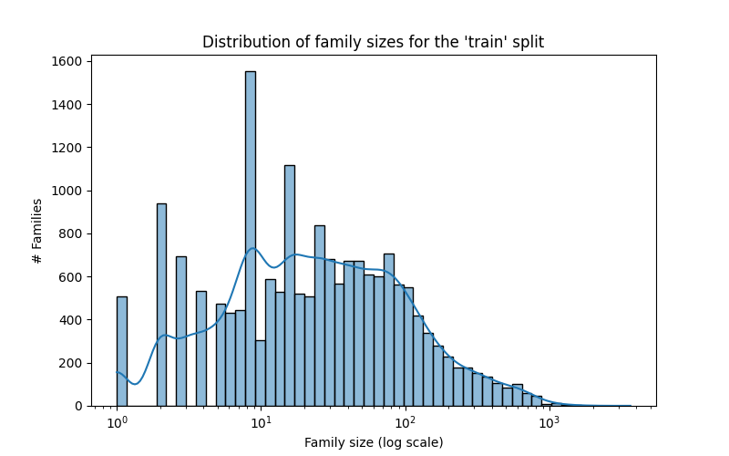

# ProteinClassification


This project aims to implement a protein classifier. Specifically, for each protein, the task is to assign the corresponding
Pfam family (i.e. protein family). You can find more information regarding the Pfam family [here](https://en.wikipedia.org/wiki/Pfam). 

The implemented base model is inspired by [ProtCNN](https://www.biorxiv.org/content/10.1101/626507v3.full).

## Where does the data come from?

The PFAM dataset is available [here](https://www.kaggle.com/googleai/pfam-seed-random-split).

      


## Installation

### Install requirements in a venv/conda environemnt
```
git clone [https://github.com/savnani5/ProteinClassification.git](https://github.com/savnani5/ProteinClassification.git)
cd ProteinClassification
pip install --no-cache-dir -r requirements.txt
```

### Download the data and copy random_split folder inside ProteinClassification folder
```
cp -r <path to random_split> <ProteinClassification/ path> (copy random_split data folder inside the ProteinClassification folder)
```

### Make a docker container for the application
```
docker compose up --build
docker compose down (to terminate the training)
```

## Dependencies
- matplotlib==3.4.1
- numpy==1.23.5
- pandas==1.2.3
- pytorch-lightning==1.5.3
- seaborn==0.11.1
- tensorboard==2.2.2
- torch==1.10.1+cu102
- torchmetrics==0.6.0
- PyYAML==5.4.1
- scipy==1.10.1
- pytest==7.4.3
  

## How To Train/Test?

### Quick Start

To change training/model parameters use **config_cnn.yaml**/**config_transformer.yaml** files.

To train the ProtCNN model:
```
python trian.py --config <path to config_cnn.yaml> (Provide --data_dir arg if random_split/ is not in ProteinClassifier path) 
```
---

To train the ProtTransformer model:
```
python trian.py --config <path to config_transformer.yaml> 
```

To run evaluation on a pretrained model (eval mode):
```
python trian.py -e -c <path to checkpoint file> (Provide --data_dir arg if random_split/ is not in ProteinClassifier path)
```
---

### Directory structure


---

### Tests

To run unit tests using pytest:
```
pytest unit_tests.py
```
---

### Visualization 

To visualize the data distribution and play with plots use the data_visualization.py script to save plot under </plots> folder.
```
python data_visualization.py (Provide --data_dir arg if random_split/ is not in ProteinClassifier path)
```

### Improvements (suggestions)

**DISCLAIMER**: Although I have implemented the improvements, I wasn't able to validate them due to high compute/time requirements and they may/maynot imporve the performance of State of the art ProtCNN model.

- Implementation and use of **Focal loss** to account for data imbalance in different protein families. We can also use weighted crossentropy loss.
- Transformer Encoder based Architecture (similar to BERT with/without positional embeddings) to model sequences better. The attention mechanism ideally should perform better compared to 1D conv feature extractor with residual blocks. This model is almost 65% smaller (50M params) compared to base ProtCNN (137M params).
- Other imporovements can be to use an Ensemble of ProtCNN models or increase the model parameters etc. to improve classification accuracy.  


## Citation

Implementation adapted from Instadeep's Starter Jupyter Notebook for ProtCNN.
